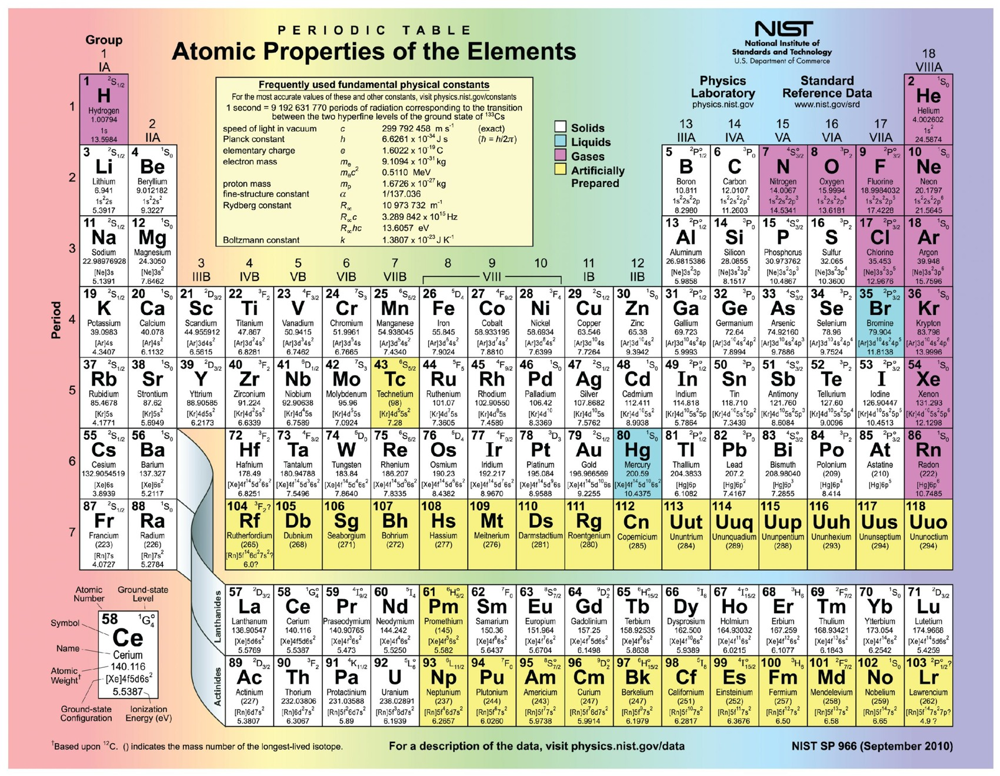
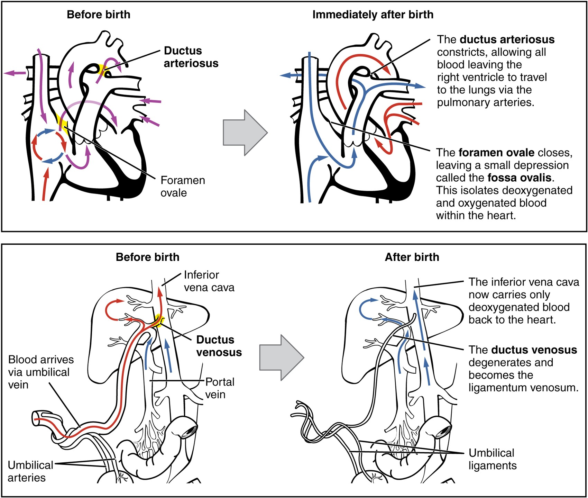
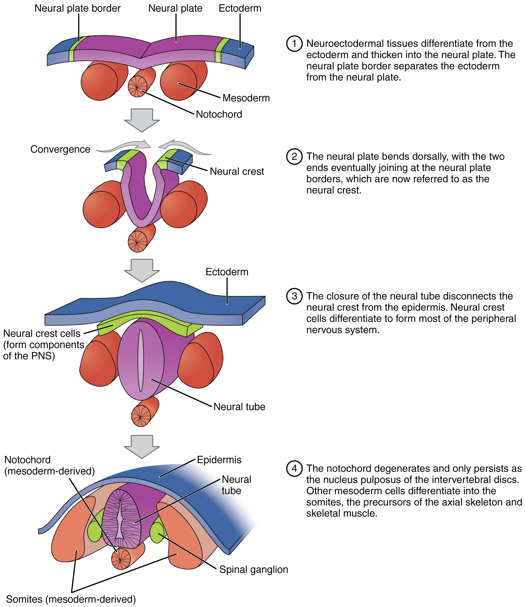

<div align="center">

# 🫀 Corpo Humano — Volume I
### Material didático interativo da turma

**Anatomia • Fisiologia • Bioquímica • Histologia • Embriologia**




</div>

---

## 📚 Sobre o projeto

Este repositório reúne o **Corpo Humano — Volume I**, um material de estudo interativo preparado para uso da nossa sala. O conteúdo foi organizado para permitir leitura progressiva: da explicação intuitiva até mecanismos mais aprofundados, com figuras, roteiros de estudo, revisão e videoaulas integradas.

> **Para estudar, não é necessário instalar nenhum programa.** Depois que o GitHub Pages estiver ativado, basta abrir o endereço do site em um navegador moderno. Para as videoaulas, é necessária conexão com a internet.

## ✨ O que há no material

| Recurso | Como ajuda no estudo |
|---|---|
| 📖 **24 capítulos** | Organizam o percurso do volume em sequência |
| 🧠 **Explicações em níveis** | Partem da intuição e avançam até relações causais e mecanismos |
| 🖼️ **Atlas visual** | Figuras ampliáveis e contextualizadas junto do texto |
| 🔎 **Acesso rápido** | Pesquisa capítulos, figuras, aulas e termos |
| 🎬 **Videoaulas** | Podem ser abertas diretamente no material publicado |
| 📝 **Revisão e roteiros** | Ajudam a recuperar conceitos e explicar com as próprias palavras |

<div align="center">
  
  &nbsp;
  
</div>

## 🌐 Publicação no GitHub Pages

A estrutura deste pacote já está pronta para publicação estática. O arquivo **`index.html` precisa permanecer na raiz do repositório**, junto da pasta `assets`.

1. Crie um repositório no GitHub — por exemplo, `corpo-humano-volume-1`.
2. Envie **todo o conteúdo deste ZIP** para a raiz do repositório, sem criar uma pasta extra envolvendo os arquivos.
3. No repositório, abra **Settings → Pages**.
4. Em **Build and deployment**, escolha **Deploy from a branch**.
5. Selecione a branch **`main`** e a pasta **`/(root)`**; depois clique em **Save**.
6. Quando a publicação terminar, o GitHub mostrará o endereço público do material na própria seção **Pages**.

### Estrutura esperada

```text
corpo-humano-volume-1/
├── index.html
├── README.md
├── .nojekyll
└── assets/
    └── atlas/
        ├── imagens...
        └── diagramas...
```

## 👩‍🏫 Para a turma

Este material foi organizado para ser usado como **apoio de estudo**, não apenas como uma lista de definições. Ao estudar um capítulo, vale seguir a sequência proposta, observar as figuras ao lado das explicações e tentar reconstruir o mecanismo sem olhar o texto antes de abrir as revisões.

<div align="center">

### 🔬 Estudar o corpo humano é conectar estruturas, processos e causas.

Feito para estudo em sala e revisão da turma. 💙

</div>
